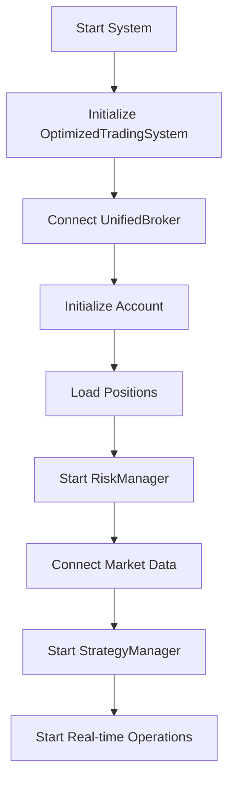
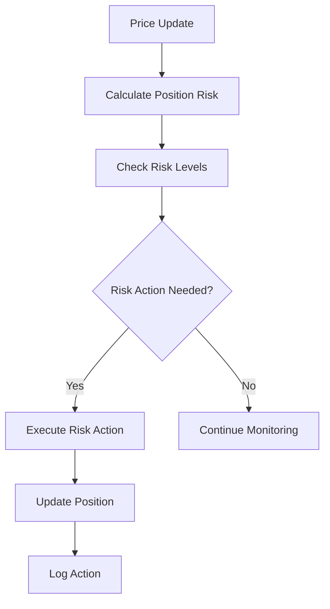

# Real-Time Cryptocurrency Trading System

A high-performance, real-time cryptocurrency trading system with live price updates, automated trading strategies, risk management, and comprehensive monitoring.

## System Architecture

### Core Components

1. **OptimizedTradingSystem** (`app.py`)
   - Main system orchestrator
   - Manages all component lifecycles
   - Handles real-time updates and system monitoring
   - Components initialized in sequence:
     1. Broker System
     2. Risk Management
     3. Market Data Feed
     4. Strategy Manager

2. **RealTimeMarketData** (`src/data/market_data_client.py`)
   - Connects to Delta Exchange WebSocket
   - Provides real-time price updates
   - Maintains live price cache
   - Features:
     - Automatic reconnection
     - Price update batching
     - Performance tracking
     - Thread-safe operations

3. **UnifiedBroker** (`src/broker/broker.py`)
   - Manages trading operations
   - Handles account management
   - Position tracking
   - Features:
     - MongoDB integration for persistence
     - Real-time position monitoring
     - Margin trading support
     - Performance tracking
     - Risk level monitoring

4. **RiskManager** (`src/broker/risk_management.py`)
   - Real-time risk assessment
   - Position monitoring
   - Features:
     - Trailing stop management
     - Risk level classification
     - Portfolio risk analysis
     - Automated risk actions

5. **OptimizedStrategyManager** (`src/strategies/simple_random_strategy.py`)
   - Implements trading strategies
   - Generates trading signals
   - Features:
     - Configurable parameters
     - Real-time market analysis
     - Signal confidence scoring

## System Workflow

### 1. System Initialization


### 2. Real-time Operations

#### Price Update Flow
1. WebSocket receives price update
2. RealTimeMarketData processes update
3. System components notified:
   - Position PnL updated
   - Risk levels checked
   - Strategy signals generated
   - Logs updated

#### Trading Flow
1. Strategy generates signal
2. Risk checks performed
3. Position sizing calculated
4. Trade executed
5. Position monitored

### 3. Risk Management Flow


## Component Details

### 1. OptimizedTradingSystem
- **Purpose**: Central system coordinator
- **Key Functions**:
  - `initialize()`: Sets up all components
  - `start_real_time_trading()`: Starts trading operations
  - `_on_price_update()`: Handles price updates
  - `_update_position_cache()`: Updates position information
  - `_update_account_cache()`: Updates account information

### 2. RealTimeMarketData
- **Purpose**: Price data management
- **Key Functions**:
  - `start()`: Initiates WebSocket connection
  - `_on_websocket_message()`: Processes market data
  - `get_live_prices()`: Returns current prices
  - `get_performance_stats()`: Returns system metrics

### 3. UnifiedBroker
- **Purpose**: Trade execution and position management
- **Key Functions**:
  - `execute_trade()`: Places new trades
  - `close_position()`: Closes positions
  - `update_prices()`: Updates position values
  - `check_risk_levels()`: Monitors risk
  - `get_account_summary()`: Returns account status

### 4. RiskManager
- **Purpose**: Risk monitoring and management
- **Key Functions**:
  - `analyze_position_risk()`: Calculates position risk
  - `execute_risk_action()`: Implements risk decisions
  - `analyze_portfolio_risk()`: Assesses overall risk
  - `_calculate_trailing_stop()`: Manages trailing stops

## Configuration

The system is highly configurable through `src/config.py`:

### Key Configuration Areas:
1. **Trading Parameters**
   - Initial balance
   - Position sizes
   - Risk limits
   - Daily trade limits

2. **Risk Parameters**
   - Stop loss percentages
   - Target percentages
   - Risk thresholds
   - Portfolio limits

3. **System Intervals**
   - Price update frequency
   - Position update frequency
   - Risk check frequency
   - Status log frequency

4. **Connection Settings**
   - WebSocket configurations
   - Database settings
   - Timeout values
   - Retry parameters

## Real-time Monitoring

The system provides comprehensive monitoring through various log types:

1. **Price Updates**
   ```
   PriceUpdate | 📊 Live Price: ETH-USD $2526.38 BTC-USD $107951.03
   ```

2. **Position Updates**
   ```
   Position | 📍 BTC-USD | LONG | Entry: $50000.00 | Current: $51000.00 | P&L: $1000.00 (+2.00%)
   ```

3. **Account Updates**
   ```
   Account | 💰 Balance: $10000.00 | P&L: +$500.00 | Positions: 2 | Risk: LOW
   ```

4. **Risk Alerts**
   ```
   Risk | ⚠️ High risk detected on BTC-USD | Action: Adjusting stop loss
   ```

## Performance Optimization

The system implements several optimization strategies:

1. **Thread Safety**
   - Locked price updates
   - Protected position access
   - Secure account operations

2. **Caching**
   - Position cache
   - Account cache
   - Price cache

3. **Performance Tracking**
   - Operation timing
   - Update frequencies
   - System metrics

4. **Error Handling**
   - Automatic reconnection
   - Graceful degradation
   - Comprehensive logging

## Getting Started

1. Install dependencies:
   ```bash
   pip install -r requirements.txt
   ```

2. Configure settings in `src/config.py`

3. Start the system:
   ```bash
   python app.py
   ```

## System Requirements

- Python 3.8+
- MongoDB
- Stable internet connection
- Sufficient memory for real-time operations

## Best Practices

1. **Monitor System Logs**
   - Check trading_bot.log regularly
   - Monitor real-time updates
   - Watch for warning signs

2. **Risk Management**
   - Start with small positions
   - Use stop losses
   - Monitor overall exposure

3. **System Maintenance**
   - Regular database backups
   - Log rotation
   - Performance monitoring 